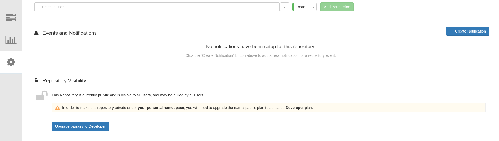

# How to create a container to run a job in OpenShift using oc and ansible
"This tutorial guides you through the process of creating a versatile image for running jobs on OpenShift, utilizing OpenShift-CLI and Ansible. The jobs can execute generic Ansible scripts specified in a ConfigMap.

## Requeriments

* Podman version 4.8.2
* OpenShift 4.14
* Red Hat OpenShift Subscription


## Summary

* [Building a Custom UBI Image](#Building-a-Custom-UBI-Image)
    * [Create a Containerfile](#Create-a-Containerfile)
    * [Build the Image](#Build-the-Image)
    * [Test the Image](#Test-the-Image)
* [Pushing the Image to quay.io](#Pushing-the-Image-to-quay.io)
    * [Login to quay.io](#Login-to-quay.io)
    * [Push the Image](#Push-the-Image)
    * [Turn the Image Public](#Turn-the-Image-Public)
* [Creating a Ansible Script in a ConfigMap](#Creating-a-Ansible-Script-in-a-ConfigMap)
* [Deploying a cronjob](#Deploying-a-cronjob)


## Building a Custom UBI Image
This sesstion will learn how to create a personalized Universal Base Image (UBI) tailored to your requirements. First step is to create a Containerfile to install OpenShift-Cli and Ansible, you need a Red Hat Subscription to download the packages.

### Create a Containerfile

```Dockefile
#Base Image (1)
FROM registry.access.redhat.com/ubi9/ubi:9.3-1476 

#Red Hat Credencials  (2)
ARG USERNAME = default_username && \
    PASSWORD = default_password 

#Environment Variables (3)
ENV USERNAME=${USERNAME} \
    PASSWORD=${PASSWORD} \
    HOME=/opt/scripts

#Update and Install Packages (4)
RUN subscription-manager register --username ${USERNAME} --password ${PASSWORD} && \
    subscription-manager repos --enable rhocp-4.13-for-rhel-9-x86_64-rpms && \
    dnf update -y --security --sec-severity=Important --sec-severity=Critical && \
    dnf install -y ansible-core.x86_64 && \
    dnf install -y openshift-clients.x86_64 && \
    dnf clean all && \
    mkdir -pv ${HOME} && \
    mkdir -pv ${HOME}/.ansible/tmp && \
    mkdir -pv ${HOME}/.kube/ && \
    mkdir -pv ${HOME}/playbooks && \
    chown -R 1001:root ${HOME} &&  \
    chgrp -R 0 ${HOME} && \
    chmod -R g+rw ${HOME} 

WORKDIR ${HOME}   

#System Volume to store the playbooks (5)
VOLUME ${HOME}/playbooks 

USER 1001

#Default Example Command (6)
ADD example.yml ${HOME}/example.yml

#Default Ansible Configuration (7)
ADD ansible.cfg /etc/ansible/ansible.cfg
```

(1) The base image is the UBI 9.3, you can use any other base image, but you need to change the package manager and the commands to install the packages.

(2) The Red Hat Credencials are used to download the packages.

(3) The environment variables are used to store the credencials and the home directory.

(4) The packages are installed using the package manager dnf, you can use yum, but you need to change the commands.

(5) The system volume is used to store the playbooks, you can use any other directory, but you need to change Containerfile.

(6) The default command is used to run the example.yml playbook, you can change the command to run any other playbook.

(7) The default ansible.cfg file is used to configure the ansible, you can change the file to configure the ansible.

### Build the Image
Now that you have created the Containerfile, you can build the image using the podman build command.

```bash
$ podman build  --build-arg USERNAME='your_user_name' --build-arg PASSWORD='your_user_password' -t quay.io/username/ubi-ansible:latest .
```
```log
STEP 1/9: FROM registry.access.redhat.com/ubi9/ubi:9.3-1476
Trying to pull registry.access.redhat.com/ubi9/ubi:9.3-1476...
Getting image source signatures
Checking if image destination supports signatures
Copying blob af8f1220909b done   | 
Copying config 745cdec666 done   | 
Writing manifest to image destination
Storing signatures
STEP 2/9: ARG USERNAME = default_username &&     PASSWORD = default_password 
--> 7531a1a62f78
STEP 3/9: ENV USERNAME=${USERNAME}     PASSWORD=${PASSWORD}     HOME=/opt/scripts
--> cc3ac3af5361
STEP 4/9: RUN subscription-manager register --username ${USERNAME} --password ${PASSWORD} &&     subscription-manager repos --enable rhocp-4.13-for-rhel-9-x86_64-rpms &&     dnf update -y --security --sec-severity=Important --sec-severity=Critical &&     dnf install -y ansible-core.x86_64 &&     dnf install -y openshift-clients.x86_64 &&     dnf clean all &&     mkdir -pv ${HOME} &&     mkdir -pv ${HOME}/.ansible/tmp &&     mkdir -pv ${HOME}/.kube/ &&     mkdir -pv ${HOME}/playbooks &&     chown -R 1001:root ${HOME} &&      chgrp -R 0 ${HOME} &&     chmod -R g+rw ${HOME} 
Registering to: subscription.rhsm.redhat.com:443/subscription
The system has been registered with ID: 4523ad41-dab5-4a3b-b15b-3e88115b9d5b
The registered system name is: 8023aae805b1
Repository 'rhocp-4.13-for-rhel-9-x86_64-rpms' is enabled for this system.
Updating Subscription Management repositories.
Red Hat OpenShift Container Platform 4.13 for R  12 MB/s |  27 MB     00:02    
Red Hat Enterprise Linux 9 for x86_64 - AppStre  15 MB/s |  28 MB     00:01    
Red Hat Enterprise Linux 9 for x86_64 - BaseOS  9.8 MB/s |  16 MB     00:01    
No security updates needed, but 1 update available
Dependencies resolved.
Nothing to do.
Complete!
Updating Subscription Management repositories.
Last metadata expiration check: 0:00:02 ago on Mon Jan 15 17:42:56 2024.
Dependencies resolved.
==============================================================================================
 Package                Arch    Version                Repository                         Size
==============================================================================================
Installing:
 ansible-core           x86_64  1:2.14.9-1.el9         rhel-9-for-x86_64-appstream-rpms  2.6 M
Installing dependencies:
 git-core               x86_64  2.39.3-1.el9_2         rhel-9-for-x86_64-appstream-rpms  4.3 M
 less                   x86_64  590-2.el9_2            rhel-9-for-x86_64-baseos-rpms     166 k
 libcbor                x86_64  0.7.0-5.el9            rhel-9-for-x86_64-baseos-rpms      59 k
 libedit                x86_64  3.1-38.20210216cvs.el9 rhel-9-for-x86_64-baseos-rpms     107 k
 libfido2               x86_64  1.13.0-1.el9           rhel-9-for-x86_64-baseos-rpms     101 k
 openssh                x86_64  8.7p1-34.el9           rhel-9-for-x86_64-baseos-rpms     465 k
 openssh-clients        x86_64  8.7p1-34.el9           rhel-9-for-x86_64-baseos-rpms     719 k
 python3-cffi           x86_64  1.14.5-5.el9           rhel-9-for-x86_64-appstream-rpms  257 k
 python3-cryptography   x86_64  36.0.1-4.el9           rhel-9-for-x86_64-baseos-rpms     1.2 M
 python3-packaging      noarch  20.9-5.el9             rhel-9-for-x86_64-appstream-rpms   81 k
 python3-ply            noarch  3.11-14.el9            rhel-9-for-x86_64-appstream-rpms  111 k
 python3-pycparser      noarch  2.20-6.el9             rhel-9-for-x86_64-appstream-rpms  139 k
 python3-pyparsing      noarch  2.4.7-9.el9            rhel-9-for-x86_64-baseos-rpms     154 k
 python3-pyyaml         x86_64  5.4.1-6.el9            rhel-9-for-x86_64-baseos-rpms     209 k
 python3-resolvelib     noarch  0.5.4-5.el9            rhel-9-for-x86_64-appstream-rpms   38 k
 sshpass                x86_64  1.09-4.el9             rhel-9-for-x86_64-appstream-rpms   30 k

Transaction Summary
==============================================================================================
Install  17 Packages

Total download size: 11 M
Installed size: 43 M
Downloading Packages:
(1/17): python3-resolvelib-0.5.4-5.el9.noarch.r  69 kB/s |  38 kB     00:00    
(2/17): sshpass-1.09-4.el9.x86_64.rpm            54 kB/s |  30 kB     00:00    
(3/17): python3-cffi-1.14.5-5.el9.x86_64.rpm    358 kB/s | 257 kB     00:00    
(4/17): python3-packaging-20.9-5.el9.noarch.rpm 232 kB/s |  81 kB     00:00    
(5/17): python3-pycparser-2.20-6.el9.noarch.rpm 338 kB/s | 139 kB     00:00    
(6/17): python3-ply-3.11-14.el9.noarch.rpm      359 kB/s | 111 kB     00:00    
(7/17): python3-pyparsing-2.4.7-9.el9.noarch.rp 529 kB/s | 154 kB     00:00    
(8/17): ansible-core-2.14.9-1.el9.x86_64.rpm    5.0 MB/s | 2.6 MB     00:00    
(9/17): git-core-2.39.3-1.el9_2.x86_64.rpm      6.9 MB/s | 4.3 MB     00:00    
(10/17): python3-pyyaml-5.4.1-6.el9.x86_64.rpm  691 kB/s | 209 kB     00:00    
(11/17): libcbor-0.7.0-5.el9.x86_64.rpm         208 kB/s |  59 kB     00:00    
(12/17): less-590-2.el9_2.x86_64.rpm            627 kB/s | 166 kB     00:00    
(13/17): libedit-3.1-38.20210216cvs.el9.x86_64. 378 kB/s | 107 kB     00:00    
(14/17): libfido2-1.13.0-1.el9.x86_64.rpm       379 kB/s | 101 kB     00:00    
(15/17): openssh-8.7p1-34.el9.x86_64.rpm        1.6 MB/s | 465 kB     00:00    
(16/17): openssh-clients-8.7p1-34.el9.x86_64.rp 1.8 MB/s | 719 kB     00:00    
(17/17): python3-cryptography-36.0.1-4.el9.x86_ 4.1 MB/s | 1.2 MB     00:00    
--------------------------------------------------------------------------------
Total                                           4.6 MB/s |  11 MB     00:02     
Running transaction check
Transaction check succeeded.
Running transaction test
Transaction test succeeded.
Running transaction
  Preparing        :                                                        1/1 
  Running scriptlet: openssh-8.7p1-34.el9.x86_64                           1/17 
  Installing       : openssh-8.7p1-34.el9.x86_64                           1/17 
  Installing       : libedit-3.1-38.20210216cvs.el9.x86_64                 2/17 
  Installing       : less-590-2.el9_2.x86_64                               3/17 
  Installing       : libcbor-0.7.0-5.el9.x86_64                            4/17 
  Installing       : libfido2-1.13.0-1.el9.x86_64                          5/17 
  Installing       : openssh-clients-8.7p1-34.el9.x86_64                   6/17 
  Running scriptlet: openssh-clients-8.7p1-34.el9.x86_64                   6/17 
  Installing       : git-core-2.39.3-1.el9_2.x86_64                        7/17 
  Installing       : python3-pyyaml-5.4.1-6.el9.x86_64                     8/17 
  Installing       : python3-pyparsing-2.4.7-9.el9.noarch                  9/17 
  Installing       : python3-packaging-20.9-5.el9.noarch                  10/17 
  Installing       : python3-ply-3.11-14.el9.noarch                       11/17 
  Installing       : python3-pycparser-2.20-6.el9.noarch                  12/17 
  Installing       : python3-cffi-1.14.5-5.el9.x86_64                     13/17 
  Installing       : python3-cryptography-36.0.1-4.el9.x86_64             14/17 
  Installing       : sshpass-1.09-4.el9.x86_64                            15/17 
  Installing       : python3-resolvelib-0.5.4-5.el9.noarch                16/17 
  Installing       : ansible-core-1:2.14.9-1.el9.x86_64                   17/17 
  Running scriptlet: ansible-core-1:2.14.9-1.el9.x86_64                   17/17 
  Verifying        : python3-cffi-1.14.5-5.el9.x86_64                      1/17 
  Verifying        : python3-resolvelib-0.5.4-5.el9.noarch                 2/17 
  Verifying        : sshpass-1.09-4.el9.x86_64                             3/17 
  Verifying        : python3-pycparser-2.20-6.el9.noarch                   4/17 
  Verifying        : python3-packaging-20.9-5.el9.noarch                   5/17 
  Verifying        : python3-ply-3.11-14.el9.noarch                        6/17 
  Verifying        : git-core-2.39.3-1.el9_2.x86_64                        7/17 
  Verifying        : ansible-core-1:2.14.9-1.el9.x86_64                    8/17 
  Verifying        : python3-pyparsing-2.4.7-9.el9.noarch                  9/17 
  Verifying        : python3-pyyaml-5.4.1-6.el9.x86_64                    10/17 
  Verifying        : libcbor-0.7.0-5.el9.x86_64                           11/17 
  Verifying        : less-590-2.el9_2.x86_64                              12/17 
  Verifying        : libedit-3.1-38.20210216cvs.el9.x86_64                13/17 
  Verifying        : libfido2-1.13.0-1.el9.x86_64                         14/17 
  Verifying        : openssh-8.7p1-34.el9.x86_64                          15/17 
  Verifying        : openssh-clients-8.7p1-34.el9.x86_64                  16/17 
  Verifying        : python3-cryptography-36.0.1-4.el9.x86_64             17/17 
Installed products updated.

Installed:
  ansible-core-1:2.14.9-1.el9.x86_64                                            
  git-core-2.39.3-1.el9_2.x86_64                                                
  less-590-2.el9_2.x86_64                                                       
  libcbor-0.7.0-5.el9.x86_64                                                    
  libedit-3.1-38.20210216cvs.el9.x86_64                                         
  libfido2-1.13.0-1.el9.x86_64                                                  
  openssh-8.7p1-34.el9.x86_64                                                   
  openssh-clients-8.7p1-34.el9.x86_64                                           
  python3-cffi-1.14.5-5.el9.x86_64                                              
  python3-cryptography-36.0.1-4.el9.x86_64                                      
  python3-packaging-20.9-5.el9.noarch                                           
  python3-ply-3.11-14.el9.noarch                                                
  python3-pycparser-2.20-6.el9.noarch                                           
  python3-pyparsing-2.4.7-9.el9.noarch                                          
  python3-pyyaml-5.4.1-6.el9.x86_64                                             
  python3-resolvelib-0.5.4-5.el9.noarch                                         
  sshpass-1.09-4.el9.x86_64                                                     

Complete!
Updating Subscription Management repositories.
Last metadata expiration check: 0:00:08 ago on Mon Jan 15 17:42:56 2024.
Dependencies resolved.
==========================================================================================================================
 Package              Arch    Version                                             Repository                          Size
==========================================================================================================================
Installing:
 openshift-clients    x86_64  4.13.0-202312150608.p0.g7780c37.assembly.stream.el9 rhocp-4.13-for-rhel-9-x86_64-rpms   49 M
Installing dependencies:
 bash-completion      noarch  1:2.11-4.el9                                        rhel-9-for-x86_64-baseos-rpms      459 k
 libpkgconf           x86_64  1.7.3-10.el9                                        rhel-9-for-x86_64-baseos-rpms       37 k
 pkgconf              x86_64  1.7.3-10.el9                                        rhel-9-for-x86_64-baseos-rpms       45 k
 pkgconf-m4           noarch  1.7.3-10.el9                                        rhel-9-for-x86_64-baseos-rpms       16 k
 pkgconf-pkg-config   x86_64  1.7.3-10.el9                                        rhel-9-for-x86_64-baseos-rpms       12 k

Transaction Summary
==========================================================================================================================
Install  6 Packages

Total download size: 49 M
Installed size: 144 M
Downloading Packages:
(1/6): libpkgconf-1.7.3-10.el9.x86_64.rpm        75 kB/s |  37 kB     00:00    
(2/6): bash-completion-2.11-4.el9.noarch.rpm    601 kB/s | 459 kB     00:00    
(3/6): pkgconf-1.7.3-10.el9.x86_64.rpm          153 kB/s |  45 kB     00:00    
(4/6): pkgconf-m4-1.7.3-10.el9.noarch.rpm        66 kB/s |  16 kB     00:00    
(5/6): pkgconf-pkg-config-1.7.3-10.el9.x86_64.r  51 kB/s |  12 kB     00:00    
(6/6): openshift-clients-4.13.0-202312150608.p0 6.8 MB/s |  49 MB     00:07    
--------------------------------------------------------------------------------
Total                                           6.9 MB/s |  49 MB     00:07     
Running transaction check
Transaction check succeeded.
Running transaction test
Transaction test succeeded.
Running transaction
  Preparing        :                                                        1/1 
  Installing       : pkgconf-m4-1.7.3-10.el9.noarch                         1/6 
  Installing       : libpkgconf-1.7.3-10.el9.x86_64                         2/6 
  Installing       : pkgconf-1.7.3-10.el9.x86_64                            3/6 
  Installing       : pkgconf-pkg-config-1.7.3-10.el9.x86_64                 4/6 
  Installing       : bash-completion-1:2.11-4.el9.noarch                    5/6 
  Installing       : openshift-clients-4.13.0-202312150608.p0.g7780c37.as   6/6 
  Running scriptlet: openshift-clients-4.13.0-202312150608.p0.g7780c37.as   6/6 
  Verifying        : openshift-clients-4.13.0-202312150608.p0.g7780c37.as   1/6 
  Verifying        : bash-completion-1:2.11-4.el9.noarch                    2/6 
  Verifying        : libpkgconf-1.7.3-10.el9.x86_64                         3/6 
  Verifying        : pkgconf-1.7.3-10.el9.x86_64                            4/6 
  Verifying        : pkgconf-m4-1.7.3-10.el9.noarch                         5/6 
  Verifying        : pkgconf-pkg-config-1.7.3-10.el9.x86_64                 6/6 
Installed products updated.

Installed:
  bash-completion-1:2.11-4.el9.noarch                                           
  libpkgconf-1.7.3-10.el9.x86_64                                                
  openshift-clients-4.13.0-202312150608.p0.g7780c37.assembly.stream.el9.x86_64  
  pkgconf-1.7.3-10.el9.x86_64                                                   
  pkgconf-m4-1.7.3-10.el9.noarch                                                
  pkgconf-pkg-config-1.7.3-10.el9.x86_64                                        

Complete!
Updating Subscription Management repositories.
51 files removed
mkdir: created directory '/opt/scripts'
mkdir: created directory '/opt/scripts/.ansible'
mkdir: created directory '/opt/scripts/.ansible/tmp'
mkdir: created directory '/opt/scripts/.kube/'
mkdir: created directory '/opt/scripts/playbooks'
--> edc8ea692a6f
STEP 5/9: WORKDIR ${HOME}   
--> f8365b73ca1f
STEP 6/9: VOLUME ${HOME}/playbooks 
--> 86977509c222
STEP 7/9: USER 1001
--> 41889e806bae
STEP 8/9: ADD example.yml ${HOME}/example.yml
--> a605585a611a
STEP 9/9: ADD ansible.cfg /etc/ansible/ansible.cfg
COMMIT quay.io/parraes/bi-ansible:latest
--> ccfd3a1ffcc4
[Warning] one or more build args were not consumed: [PASSWORD]
Successfully tagged quay.io/parraes/ubi-ansible:latest
ccfd3a1ffcc4227ac67f08fab81181cd1bd58bee37077ee38b617a1c2cdb3ea6
```

### Test the Image
Now that you have created the image, you can test the image using the podman run command.

```bash
$ podman run -it quay.io/username/ubi-ansible:latest ansible-playbook example.yml
```
```log
[WARNING]: provided hosts list is empty, only localhost is available. Note that the implicit localhost does not match 'all'

PLAY [This is a ansible script hello-world] **************************************************************************************************************************************************************************************************

TASK [Hello Ansible] *************************************************************************************************************************************************************************************************************************
changed: [localhost]

PLAY RECAP ***********************************************************************************************************************************************************************************************************************************
localhost                  : ok=1    changed=1    unreachable=0    failed=0    skipped=0    rescued=0    ignored=0   
```

## Pushing the Image to quay.io
Explore the process of pushing your customized image to quay.io for seamless accessibility and distribution. You can user any other registry, but you need to change the commands.

### Login to quay.io
```bash
$ podman login quay.io -u your_username -p your_password
```
```log
Login Succeeded!
```
### Push the Image
```bash
$ podman push quay.io/username/ubi-ansible:latest
```
```log
Getting image source signatures
Copying blob 20d69397e354 skipped: already exists  
Copying blob 15e504407dcb done   | 
Copying blob e206db761e93 skipped: already exists  
Copying blob b4be8eb5308c skipped: already exists  
Copying config 1efb18183e done   | 
Writing manifest to image destination
```

### Turn the Image Public
To turn the image public, you need to change the image visibility in the quay.io. Access the quay.io and change the image visibility to public, as shown in the following image.




## Configuring an Ansible Script within a ConfigMap
Understand the steps involved in setting up an Ansible script within a ConfigMap, ensuring efficient configuration management.

## Deploying a CronJob
Discover how to deploy a scheduled job using cron, enabling automated and periodic execution of your configured tasks.


